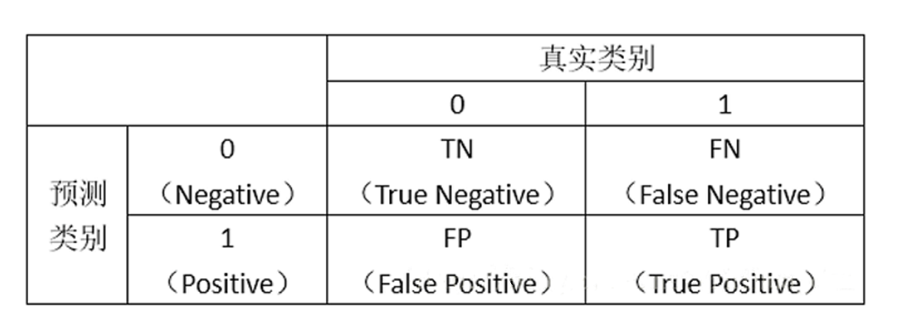
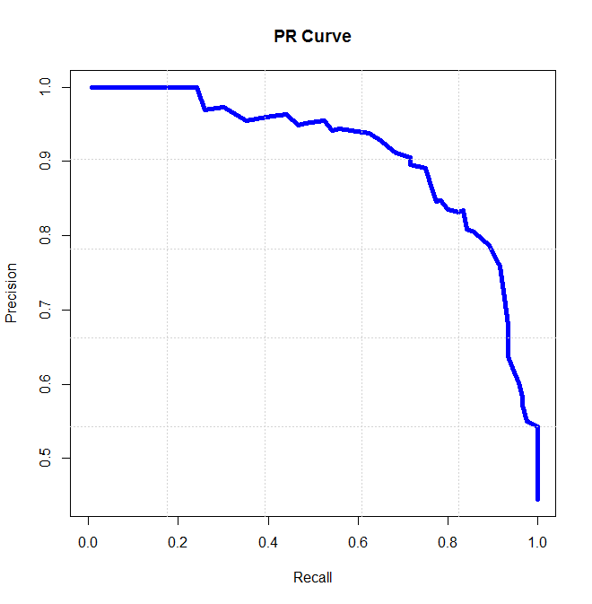

### 实验名称

文本分类实战：中文垃圾邮件分类

### 实验目的

本实验主要实现中文垃圾邮件分类验。通过该实验的学习与实践，希望学生可以：

1.掌握sklearn基本用法。

2.掌握jieba分词对中文的分词操作。
	3.运用伯努利贝叶斯分类器实现垃圾邮件分类。

### 实验背景

文本挖掘（Text Mining，从文字中获取信息）是一个比较宽泛的概念，这一技术在如今每天都有海量文本数据生成的时代越来越受到关注。目前，在机器学习模型的帮助下，包括情绪分析，文件分类，话题分类，文本总结，机器翻译等在内的诸多文本挖掘应用都已经实现了自动化。在这些应用中，垃圾邮件分类是一个经典的机器学习分类算法案例，接下来我们就实现以下中文垃圾邮件分类。

### 实验原理

#### 一、伯努利贝叶斯分类器原理

伯努利贝叶斯分类器将某类别下的文档的生成看作是做m次独立的贝努利试验，其中m是词汇表的长度，每次试验都通过抛硬币（假定是1/2的比例，当然实际要通过统计）决定这次对应的词语是否在文本中出现。因此它的似然概率计算公式为P(t|c)=类c文档集中包含词t的文档数/类c文档集中文档总数。而多项式朴素贝叶斯将某类别下的文档的生成看成从词汇表中有放回的抽样，每次随机抽一个词出来，一共抽取文档长度次（单词个数）。因此它的似然概率计算公式为P(t|c)=类c文档集中词语t出现的次数/类c文档集中词语总数。

#### 二、sklearn中使用伯努利贝叶斯分类器

Scikit-learn(sklearn)是机器学习中常用的第三方模块，对常用的机器学习方法进行了封装，包括回归(Regression)、降维(Dimensionality Reduction)、分类(Classfication)、聚类(Clustering)等方法。当我们面临机器学习问题时，便可根据下图来选择相应的方法。

sklearn具有以下特点：

1、简单高效的数据挖掘和数据分析工具

2、让每个人能够在复杂环境中重复使用

3、建立NumPy、Scipy、MatPlotLib之上

sklearn伯努利贝叶斯分类器说明如下：

class sklearn.naive_bayes.BernoulliNB(alpha=1.0, binarize=0.0, fit_prior=True, class_prior=None)

参数介绍：

alpha: 一个浮点数，平滑值。

binarize: 一个浮点数或者None。如果为None，那么会假定原始数据已经二元化了；如果是浮点数，那么会以该数值为界，特征取值大于它的作为1；特征取值小于它的作为0。采取这种策略来二元化。

fit_prior: 布尔值。如果为True，则不去学习类别先验概率，替代以均匀分布；如果为False，则去学习类别先验概率。

class_prior: 一个数组。它指定了每个分类的先验概率，如果指定了该参数，则每个分类的先验概率不再从数据集中学得。

属性说明：

class_count_: 一个数组，形状为(n_classes,)，是每个类别包含的训练样本数量

feature_count_: 一个数组，形状为(n_classes, n_features)。训练过程中，每个类别每个特征遇到的样本数

方法说明：

fit(x, y[, sample_weight]): 训练模型

predict(x): 用模型进行预测，返回预测值

score(x, y[, sample_weight]): 返回在(x, y)上预测的准确率

#### 三、jieba中文分词

 jieba是优秀的中文分词第三方库，需要额外安装。中文文本需要通过分词获得单个的词语， jieba库提供三种分词模式。

精确模式：试图将语句最精确的切分，不存在冗余数据，适合做文本分析。

全模式：将语句中所有可能是词的词语都切分出来，速度很快，但是存在冗余数据。

搜索引擎模式：在精确模式的基础上，对长词再次进行切分。

### 实验环境

ubuntu==16.04
	python==3.6

sklearn==0.21.3

jieba==0.42.1


### 建议课时

建议课时2课时

### 实验步骤

#### 一、环境安装和数据准备

安装sklearn库

```
pip install sklearn==0.21.3
```

安装jieba分词库

```
pip install jieba==0.42.1
```

我们将使用到sklearn机器学习库完成实验。为了方便学习，将邮件数据保存成文本格式，每行文本对应一个邮件，数据在data/下。主要有表所示的两类数据：

|   数据名称    | 数据类型 |
| :-----------: | :------: |
| ham_data.txt  | 正常邮件 |
| spam_data.txt | 垃圾邮件 |

代码组织分为三个功能：

data_loader.py： 读取邮件数据、停用词列表

data_processing.py：数据清洗以及数据集转化

classifier.py：模型训练、预测、评价

#### 二、 读取邮件数据、停用词列表转换

首先从data_loader.py开始，主要包括两个功能，get_data函数返回两个文本内容以及对应的标签，get_stopwords函数返回停用词集合。

```python
#coding=utf-8
import numpy as np

DATA_DIR = "data"

def get_data(path = DATA_DIR):
    '''
    获取数据
    :return: 文本数据，对应的labels
    '''
    with open(path + "/ham_data.txt", encoding="utf8") as ham_f, \
            open(path + "/spam_data.txt", encoding="utf8") as spam_f:

        ham_data = [x.strip() for x in ham_f.readlines() if x.strip()]
        spam_data = [x.strip() for x in spam_f.readlines() if x.strip()]

        ham_label = np.ones(len(ham_data)).tolist()
        spam_label = np.zeros(len(spam_data)).tolist()

        corpus = ham_data + spam_data
        labels = ham_label + spam_label

    return corpus, labels

def get_stopwords(path = DATA_DIR):
    with open(path + "/stop_words.utf8", encoding="utf8") as f:
        stopword_list = set([x.strip() for x in f.readlines()] +
                            list(r'!"#$%&\'()*+,-./:;<=>?@[\\]^_`{|}~'))
    return  stopword_list
```

#### 三、数据清洗以及数据集转化

其次是data_processing.py。norm_corpus函数用来对文本数据进行分词以及停用词过滤，convert_data函数使用的是sklearn库中的Vectorizer进行文本数据集直接转换成可直接进行算法输入的矩阵形式。

```python
#coding=utf-8
import re
import jieba

def norm_corpus(corpus, stopword_list):
    result_corpus = []
    ##匹配连续2个以上的英文+空格符号， 后面替换成一个空格
    pattern = re.compile('[{}\\s]'.format(re.escape(r'!"#$%&\'()*+,-./:;<=>?@[\\]^_`{|}~')) + r"{2,}")
    for text in corpus:
        #分词，按停用词表过滤
        seg_text = ' '.join([x.strip() for x in jieba.cut(text) if x.strip() not in stopword_list])
        result_corpus.append(pattern.sub(" ", seg_text))
    return result_corpus


def convert_data(norm_train, norm_test, vectorizer):
    ## fit把数据集中所有文字按规则（默认空格）切分成词元以后每个词元记录一个数字
    ## transform对切分文字匹配出数字id，作为向量维度下标
    ## fit_transform ：两个功能合在一起
    train_features = vectorizer.fit_transform(norm_train)
    test_feature = vectorizer.transform(norm_test)
    return train_features, test_feature, vectorizer
```

#### 四、模型训练、预测

首先在进行分类前的先查看一下数据情况（classifier.py前面部分）

```python
#coding=utf-8
import data_loader
import data_processing
from sklearn.model_selection import train_test_split
from sklearn.feature_extraction.text import CountVectorizer

DATA_DIR = data_loader.DATA_DIR

corpus, labels = data_loader.get_data(DATA_DIR)
stopwords = data_loader.get_stopwords(DATA_DIR)
#train_test_split将数据集按test_size划分测试、训练集， random_state相同每次随机结果都一样
corpus_train, corpus_test, y_train, y_test = train_test_split(corpus,  labels, test_size=0.4,  random_state=1)

norm_train = data_processing.norm_corpus(corpus_train, stopwords)
norm_test = data_processing.norm_corpus(corpus_test, stopwords)
#文本数据转成矩阵形式；CountVectorizer是转换器，保留篇频最小值为2
x_train, x_test, vectorizer = data_processing.convert_data(
                    norm_train, norm_test, CountVectorizer(min_df=2) )

print("全部数据数量：", len(corpus_train) + len(corpus_test))
print("训练数据数量：", len(corpus_train), "\n")
print("分词后的文本样例：\n", norm_train[1])
print("训练集特征词数量：", len(vectorizer.get_feature_names()))
```

这里为了后面实验方便，先将所有数据集先划分为训练集和测试集再进行数据清洗。后续实验使用的是CountVectorizer进行文本转换，x_train, x_test是转换后的矩阵。运行结果如下

```
全部数据数量： 10001
训练数据数量： 6000 

分词后的文本样例：
 没有 说法 优秀 标 题 Re 一个 不入流 大学 学生 考 清华 研究生 大专 会 面试 刷掉 内部 规定 真的 春阳 昨日 碧树鸣 黄鹂 芜然 蕙 草 暮 飒尔 凉风 吹 天秋 木叶 月 冷莎鸡 悲 坐愁 群芳 歇 白露 凋 华滋
训练集特征词数量： 12643
```

接下来要进行的是模型训练与预测，代码如下：

```python
from sklearn.naive_bayes import BernoulliNB
LABELS = ["垃圾邮件","正常邮件"]

def show_prediction(idx_list):
    model = BernoulliNB() #选择模型
    model.fit(x_train, y_train)  #训练模型
    y_pred = model.predict(x_test)  #模型预测，每条记录返回0,1
    for idx in idx_list:
        print("原来的邮件类别：", LABELS[int(y_test[idx])])
        print("预测的邮件类别：", LABELS[int(y_pred[idx])])
        print("正文：\n", corpus_test[idx])
        print("=========================")

show_prediction([0,1])
```

show_prediction函数中，训练模型只需要简单一句model.fit就可以完成模型训练，调用函数输出测试集前两天记录的结果如下：

```
原来的邮件类别： 垃圾邮件
预测的邮件类别： 垃圾邮件
正文：
 贵公司您好! 我是广州市广通贸易有限公司:本公司因多项业绩;做不了国家每月定税额.为减少损失.现有佘积发票对外代开. 代开范围:(商品销售.运输.建筑等其它发票)欢迎贵公司来电咨询. 谢谢: 祝: 商祺洽谈 广州市广通贸易有限公司 联系电话:013560399256 联系人 :张伟建 地  址 :广州市花地大道金融大厦602-605室
=========================
原来的邮件类别： 正常邮件
预测的邮件类别： 正常邮件
正文：
 可惜批评他的人心理阴暗的更多 从那些人生攻击的贴里就可以看出 标  题: Re: 批评王垠的人 你心理阴暗了。 : 其实很多批评王垠的人的处境和王垠有很多类似的地方，只是没有王垠那么潇洒一退 : 了之，还得苟且的活着，去适应这个自己也不满意的环境。 : 王的退学无疑给这些人一个沉重的打击，有些人当然坐不住了，就开始说王其实根本没有搞 --
=========================
```

可以看到模型对新的文本的类型都判断正确了。

#### 五、模型评价

分类的评价指标有很多来自于信息检索（Infomation Retrival）领域，这里先介绍一下分类结果的四种可能：

- True positives(TP):  被正确地划分为正例的个数，即实际为正例且被分类器划分为正例的实例数（样本数）；
- False positives(FP): 被错误地划分为正例的个数，即实际为负例但被分类器划分为正例的实例数；
- False negatives(FN):被错误地划分为负例的个数，即实际为正例但被分类器划分为负例的实例数；
- True negatives(TN): 被正确地划分为负例的个数，即实际为负例且被分类器划分为负例的实例数。

可以用一个混淆矩阵（Confusion Matrix）来表示：

 

常用的分类评价指标准确率（Pression）、召回率（Recall）、精确率（Accuray）的公式如下：
$$
Pression={\frac {TP}{TP+FP}}
$$

$$
Recall = {\frac {TP}{TP+FN}}
$$

$$
Accuracy = {\frac {TP+FN}{TP+FN+FP+FN}}
$$

准确率和召回率整体上是负相关：



因此用F1-measure能更全面地评估分类整体效果：
$$
F1-measure = {\frac {2 * Pression*Recall}{Pression+Recall}}
$$
通过混淆矩阵以及各项评价指标，就可以很直观的比较每种分类器之间的优劣。在sklearn中，这些评价函数都可以直接使用，无需自行实现，confusion_matrix函数可以直接返回混淆矩阵，而classification_report函数直接包含准确率、召回率和F1。下面的代码比较了朴素贝叶斯和逻辑回归两个分类器的效果：

```python
from sklearn.linear_model import LogisticRegression
from sklearn.metrics import confusion_matrix, classification_report
def evaluate_models():
    models = { "朴素贝叶斯": BernoulliNB(),"逻辑回归": LogisticRegression()}
    for model_name, model in models.items():
        print("分类器：", model_name)
        model.fit(x_train, y_train)
        y_pred = model.predict(x_test)
        report = classification_report(y_test, y_pred, target_names=LABELS)
        print("混淆矩阵：\n", confusion_matrix(y_test, y_pred))
        print("分类报告\n", report)

evaluate_models()
```

结果如下：

```
分类器： 朴素贝叶斯
混淆矩阵：
 [[1971   16]
 [  27 1987]]
分类报告
               precision    recall  f1-score   support

        垃圾邮件       0.99      0.99      0.99      1987
        正常邮件       0.99      0.99      0.99      2014

    accuracy                           0.99      4001
   macro avg       0.99      0.99      0.99      4001
weighted avg       0.99      0.99      0.99      4001

分类器： 逻辑回归
混淆矩阵：
 [[1981    6]
 [  20 1994]]
分类报告
               precision    recall  f1-score   support

        垃圾邮件       0.99      1.00      0.99      1987
        正常邮件       1.00      0.99      0.99      2014

    accuracy                           0.99      4001
   macro avg       0.99      0.99      0.99      4001
weighted avg       0.99      0.99      0.99      4001

```

### 实验总结

从各项指标看，两种分类器对本数据集分类效果都很好。从混淆矩阵的结果可以看出逻辑回归模型比朴素贝叶斯模型效果更好一些。